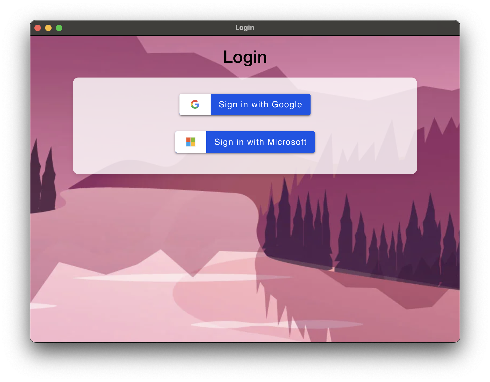

<h1 align="center">
  
  Electron OAuth App
</h1>

<p align="center">
  
</p>


[](https://github.com/APratham/electron-oauth-app-prod/actions/workflows/release.yml)


## Overview

Electron OAuth App is a cross-platform desktop application that demonstrates how to implement OAuth authentication using Google Sign-In. The app is built with Electron providing a seamless login/logout flow with OAuth 2.0. This is built as part of the project "AIOps and Predictive Analytics for Container Logs Monitoring". Project files can be found [here](https://github.com/APratham/AIOps-containers) once they're made open source. Check the [project website](https://apratham.github.io/AIOps-containers) for more information.

## Status
This application and the project it's a part of are currently in active development stage. Basic OAuth login and logout functionalities are implemented in the application, and more improvements and additional features are planned.

## Purpose
The primary purpose of this application is to serve as a reference implementation for developers looking to integrate OAuth authentication into their Electron applications. It showcases the use of Ionic components for a consistent UI and provides a clear example of handling OAuth flows in a desktop environment.

## Usage
### Prerequisites
- Node.js (v12 or higher)
- npm (v6 or higher)
- Google OAuth credentials
- Microsoft OAuth credentials

### Installation
1. Clone the repository:
    ```bash
    git clone https://github.com/APratham/electron-oauth-app.git
    cd electron-oauth-app
    ```
2. Install dependencies:
    ```bash
    npm install
    ```
3. Run the application:
    ```bash
    npm run start
    ```

### Google OAuth Setup
1. Create a new project on the [Google Cloud Console](https://console.cloud.google.com/).
2. Create an OAuth consent screen by adding name, email ID and developer contact information. **Do not** add a logo because it will ask for app verification.
3. No need to add any scopes to your application. You can add test users if needed.
4. Google allows adding upto 100 test users before verification will be needed.
5. Create a client ID for application type as desktop app and name it whatever you want.
6. Obtain the client ID and client secret and add them to `secrets.example.js` file. Rename the file to `secrets.js`.

### Microsoft OAuth Setup
1. Create a new project on [Azure Portal](https://portal.azure.com/#home).
2. Go through the steps to create an App Registration for a Desktop app.
3. Mention `myapp://auth` in the redirect URI.
4. Once the App Registration is created, you have to edit the Manifest. Microsoft doesn't have a way to allow Implicit grants through the UI, so we need to use the Manifest. Look for `auth2AllowIdTokenImplicitFlow` and `oauth2AllowImplicitFlow` and make those values `true`. Now when you go to Authentication you can see that "Access tokens" and "ID tokens" are checked.
4. You have to go to API permissions and assign the following permissions through Microsoft Graph delegated permissions:
    - `email`
    - `offline_access`
    - `openid`
    - `profile`
    - `User.Read`
5. Add the client ID, tenant ID, and the redirect URI to `secrets.example.js` file and then rename it to `secrets.js`


## Contributions
Contributions to this repository are not allowed as it is part of a project that is in active development.

## Contact
For questions or issues related to this branch, please contact the [Project Team](https://github.com/APratham/electron-oauth-app/wiki#project-team).

## License
This application and the project are licensed under the [GNU Affero General Public License v3](https://opensource.org/license/agpl-v3). See the [LICENSE](LICENSE) file for more details.