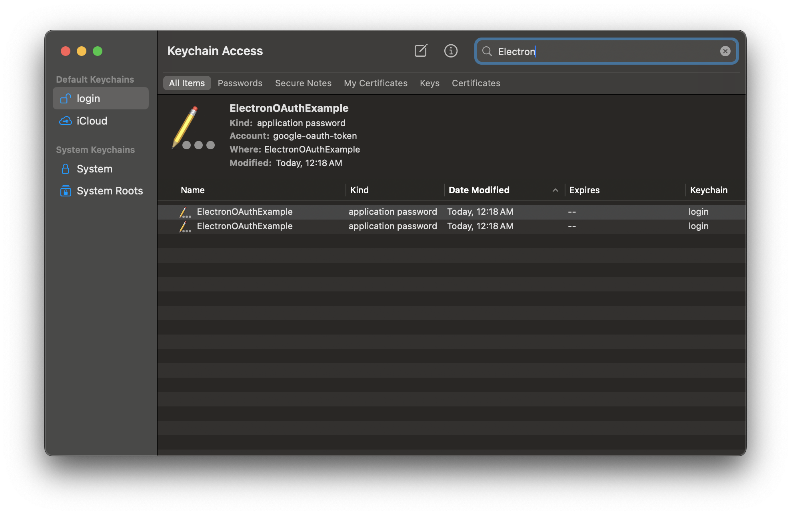

# Installation Instructions - macOS
*These instructions are for Apple Sillicon only

1. Download the .dmg file from the release assets. Drag the app icon to the Applications folder to complete installation.

2. You will be prompted with a message saying that the app is damaged and shouldn't be opened

3. To run the application properly, you need to delete the attributes file. You can do this by running `xattr -d com.apple.quarantine /Applications/Electron\\ OAuth\\ App.app`

## Common Issues

### Keytar access
1. The application uses a library called `keytar` to store credentials natively in the OS for securely storing credentials. On macOS it uses macOS Keychain. This can sometimes lead to issues where it is not able to access the Keychain.

2. To resolve this, you need to grant the application access to the credentials it has created. 

3. Open "Keychain Access" from the Launchpad. It will prompt you asking if you want to open "Keychain Access", or you just want to manage your Passwords.

4. Here you need to search for the name of the application to see the credentials that it has created. 

5. Then you need to go to the access control tab and provide access to the installed application. You may be prompted for your "login" Keychain password. You can enter your macOS login password.

